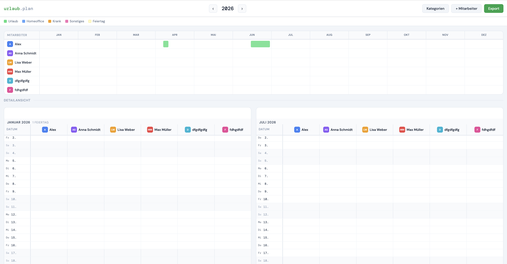

# 🌴 Vacation Planner

A lightweight, self-hosted vacation and absence planner for small teams. No cloud, no subscriptions — just Docker.



## Features

- 📊 **Year overview** — compact Gantt-style bars for all employees at a glance
- 📅 **Detail calendar** — day-by-day view split into two half-year columns
- 👥 **Employee management** — add/remove team members
- 🏷️ **Custom categories** — e.g. Vacation, Sick, Home Office (fully configurable with colors)
- 🇩🇪 **German public holidays** — Berlin holidays pre-configured (incl. Easter-based holidays)
- 💾 **Persistent storage** — SQLite database via Docker volume
- 🔌 **Works without backend too** — falls back to localStorage automatically (e.g. for previews)
- 🌐 **Reverse proxy ready** — works great behind Nginx Proxy Manager

## Quick Start

### With Docker Compose

```yaml
services:
  vacation:
    image: ghcr.io/YOURUSERNAME/vacation-planner:latest
    container_name: vacation
    restart: unless-stopped
    ports:
      - "127.0.0.1:8084:8000"
    volumes:
      - vacation-data:/data

volumes:
  vacation-data:
```

### Build locally

```bash
git clone https://github.com/YOURUSERNAME/vacation-planner.git
cd vacation-planner
docker build -t vacation-planner:latest .
docker compose up -d
```

Then open [http://localhost:8084](http://localhost:8084)

## Usage

1. **Add employees** via the "+ Mitarbeiter" button
2. **Add categories** via "Kategorien" (name + color)
3. **Click any cell** in the detail calendar to add an entry
4. **Click an existing bar** to edit or delete it
5. **Hover** over any bar for a tooltip with details
6. **Export** your data as JSON anytime

## Stack

| Component | Technology |
|-----------|------------|
| Backend   | Python / FastAPI |
| Database  | SQLite |
| Frontend  | Vanilla HTML/CSS/JS |
| Container | Docker / Alpine |

## Behind a Reverse Proxy (e.g. Nginx Proxy Manager)

If NPM and the vacation container share a Docker network:

- **Forward Hostname**: `vacation` (container name)
- **Forward Port**: `8000`

## Data

All data is stored in a Docker volume at `/data/vacation.db`. To back it up:

```bash
docker cp vacation:/data/vacation.db ./vacation-backup.db
```

## License

MIT — do whatever you want with it.
